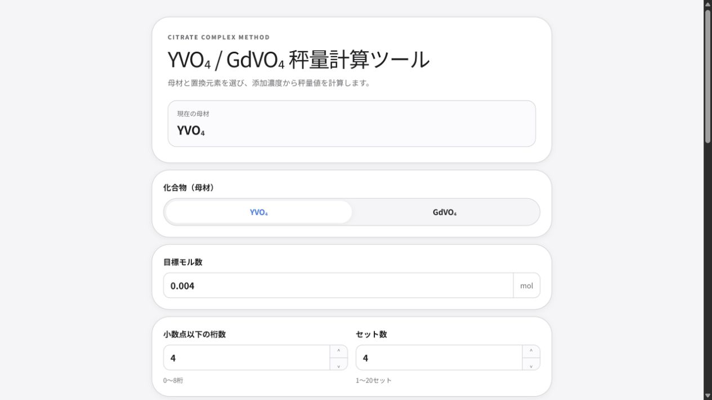
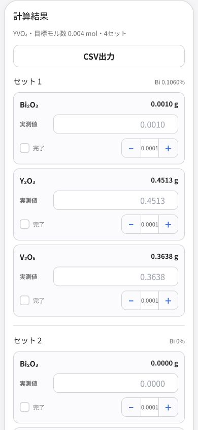

# Weighing Calculator

YVO₄ / GdVO₄をクエン酸錯体重合法で合成するときの、酸化物の秤量値を計算・記録するWebアプリです。

**公開アプリ:** [weighing-calculator.vercel.app](https://weighing-calculator.vercel.app/yvo4-gdvo4)



## できること

- YVO₄ / GdVO₄の母材を切り替えて秤量値を計算
- Tm、Eu、Erなどの希土類置換元素を複数選択
- Biを希土類とは分けた「その他の置換元素」として計算
- 濃度を`0.1060`のように、設定した小数桁数を保ったまま入力
- 小数点以下0〜8桁、1〜20セットを自由に設定
- 上下矢印キーまたは`−` / `＋`ボタンで最小桁単位の微調整
- 計算値・実測値・秤量済みチェックをセットごとに管理
- 結果をCSVで出力
- 入力内容をブラウザに自動保存
- Apple製品のような余白・角丸・配色を意識したレスポンシブUI

## 使い方

1. 「化合物（母材）」でYVO₄またはGdVO₄を選びます。
2. 目標モル数、小数点以下の桁数、セット数を設定します。
3. 使用する希土類元素、またはBiを選びます。
4. 各セットの添加濃度を入力します。たとえば`0.1060`と入力できます。
5. 「計算する」を押します。
6. 実際に量り取った値を「実測値」へ入力し、完了した試薬にチェックを付けます。
7. 必要に応じて「CSV出力」で記録を保存します。

スマートフォンでは、チェックボックスを小さく保ちつつ、実測値の横に微調整ボタンを表示します。



## Biの扱い

Biは希土類元素ではありませんが、母材サイトを置換します。Bi₂O₃の設定濃度に応じて、Y₂O₃ / Gd₂O₃の母材量から差し引いて計算します。

## ローカルで実行

```bash
npm install
npm run dev
```

[http://localhost:3000/yvo4-gdvo4](http://localhost:3000/yvo4-gdvo4) を開いてください。

本番ビルドの確認:

```bash
npm run build
```

## 技術構成

- Next.js
- React
- Tailwind CSS
- Vercel

## Author

Kou Hashizume
